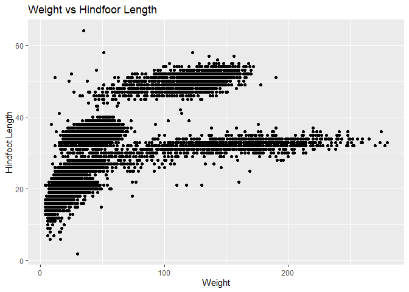

## Instructions
Answer the following questions and complete the exercises in RMarkdown. Please embed all of your code and push your final work to your repository. Your final lab report should be organized, clean, and run free from errors. Remember, you must remove the `#` for the included code chunks to run. Be sure to add your name to the author header above. For any included plots, make sure they are clearly labeled. You are free to use any plot type that you feel best communicates the results of your analysis.  

Make sure to use the formatting conventions of RMarkdown to make your report neat and clean!  

## Load the libraries

```r
library(tidyverse)
library(janitor)
library(here)
library(naniar)
```

## Desert Ecology
For this assignment, we are going to use a modified data set on [desert ecology](http://esapubs.org/archive/ecol/E090/118/). The data are from: S. K. Morgan Ernest, Thomas J. Valone, and James H. Brown. 2009. Long-term monitoring and experimental manipulation of a Chihuahuan Desert ecosystem near Portal, Arizona, USA. Ecology 90:1708.

```r
deserts <- read_csv(here("lab10", "data", "surveys_complete.csv"))
```

```
## 
## -- Column specification --------------------------------------------------------
## cols(
##   record_id = col_double(),
##   month = col_double(),
##   day = col_double(),
##   year = col_double(),
##   plot_id = col_double(),
##   species_id = col_character(),
##   sex = col_character(),
##   hindfoot_length = col_double(),
##   weight = col_double(),
##   genus = col_character(),
##   species = col_character(),
##   taxa = col_character(),
##   plot_type = col_character()
## )
```

1. Use the function(s) of your choice to get an idea of its structure, including how NA's are treated. Are the data tidy?  

```r
glimpse(deserts)
```

```
## Rows: 34,786
## Columns: 13
## $ record_id       <dbl> 1, 2, 3, 4, 5, 6, 7, 8, 9, 10, 11, 12, 13, 14, 15, ...
## $ month           <dbl> 7, 7, 7, 7, 7, 7, 7, 7, 7, 7, 7, 7, 7, 7, 7, 7, 7, ...
## $ day             <dbl> 16, 16, 16, 16, 16, 16, 16, 16, 16, 16, 16, 16, 16,...
## $ year            <dbl> 1977, 1977, 1977, 1977, 1977, 1977, 1977, 1977, 197...
## $ plot_id         <dbl> 2, 3, 2, 7, 3, 1, 2, 1, 1, 6, 5, 7, 3, 8, 6, 4, 3, ...
## $ species_id      <chr> "NL", "NL", "DM", "DM", "DM", "PF", "PE", "DM", "DM...
## $ sex             <chr> "M", "M", "F", "M", "M", "M", "F", "M", "F", "F", "...
## $ hindfoot_length <dbl> 32, 33, 37, 36, 35, 14, NA, 37, 34, 20, 53, 38, 35,...
## $ weight          <dbl> NA, NA, NA, NA, NA, NA, NA, NA, NA, NA, NA, NA, NA,...
## $ genus           <chr> "Neotoma", "Neotoma", "Dipodomys", "Dipodomys", "Di...
## $ species         <chr> "albigula", "albigula", "merriami", "merriami", "me...
## $ taxa            <chr> "Rodent", "Rodent", "Rodent", "Rodent", "Rodent", "...
## $ plot_type       <chr> "Control", "Long-term Krat Exclosure", "Control", "...
```

```r
deserts %>% 
  count("NA")
```

```
## # A tibble: 1 x 2
##   `"NA"`     n
##   <chr>  <int>
## 1 NA     34786
```
Data are relatively tidy upon viewing the data. NA are present in the data, being recorded as "NA" - thus will be easy to filter out later on (better than it being -9999999)

2. How many genera and species are represented in the data? What are the total number of observations? Which species is most/ least frequently sampled in the study?

```r
names(deserts)
```

```
##  [1] "record_id"       "month"           "day"             "year"           
##  [5] "plot_id"         "species_id"      "sex"             "hindfoot_length"
##  [9] "weight"          "genus"           "species"         "taxa"           
## [13] "plot_type"
```


```r
deserts %>% 
  count(genus)
```

```
## # A tibble: 26 x 2
##    genus                n
##    <chr>            <int>
##  1 Ammodramus           2
##  2 Ammospermophilus   437
##  3 Amphispiza         303
##  4 Baiomys             46
##  5 Calamospiza         13
##  6 Callipepla          16
##  7 Campylorhynchus     50
##  8 Chaetodipus       6029
##  9 Cnemidophorus        2
## 10 Crotalus             2
## # ... with 16 more rows
```

```r
species_count<- deserts %>% 
  count(species)
species_count %>% 
  filter(n == max(species_count$n) | n == min(species_count$n)) %>% 
  arrange(n)
```

```
## # A tibble: 7 x 2
##   species          n
##   <chr>        <int>
## 1 clarki           1
## 2 scutalatus       1
## 3 tereticaudus     1
## 4 tigris           1
## 5 uniparens        1
## 6 viridis          1
## 7 merriami     10596
```

There are 26 genera and 40 species included in the data - merriama has the most species entries and there are a few species with only one entry.

3. What is the proportion of taxa included in this study? Show a table and plot that reflects this count.

```r
deserts %>% 
  count(taxa)
```

```
## # A tibble: 4 x 2
##   taxa        n
##   <chr>   <int>
## 1 Bird      450
## 2 Rabbit     75
## 3 Reptile    14
## 4 Rodent  34247
```

```r
deserts %>%
   ggplot(aes(x = taxa)) + geom_bar() + scale_y_log10() +
  labs(title = "taxa count",
       x = "Taxa",
       y = "Count")
```

<!-- -->

4. For the taxa included in the study, use the fill option to show the proportion of individuals sampled by `plot_type.`

```r
deserts %>%
   ggplot(aes(x = taxa, fill = plot_type)) + geom_bar() + scale_y_log10() +
  labs(title = "Proportion of Taxa",
       x = "Taxa",
       fill = "Plot Type")
```

<!-- -->


5. What is the range of weight for each species included in the study? Remove any observations of weight that are NA so they do not show up in the plot.

```r
deserts %>%
  filter(weight!="NA") %>% 
  ggplot(aes(x=species, y=weight))+geom_boxplot()+scale_y_log10()+coord_flip()
```

<!-- -->


6. Add another layer to your answer from #4 using `geom_point` to get an idea of how many measurements were taken for each species.

```r
deserts %>% 
  filter(weight != "NA") %>% 
  ggplot(aes(x=species, y=weight)) + geom_point() + coord_flip() + geom_boxplot(na.rm=T) + geom_smooth(method=lm, se=F)+ 
  labs(title="Species vs. Weight",
       x="Species",
       y="Weight")
```

```
## `geom_smooth()` using formula 'y ~ x'
```

<!-- -->


7. [Dipodomys merriami](https://en.wikipedia.org/wiki/Merriam's_kangaroo_rat) is the most frequently sampled animal in the study. How have the number of observations of this species changed over the years included in the study?

```r
deserts %>% 
  filter(species == "merriami") %>% 
  ggplot(aes(x = year)) +
  geom_bar() +
  labs(title = "Dipodomys Merriami Sampled by Year",x = "Year", y = "n")
```

<!-- -->


8. What is the relationship between `weight` and `hindfoot` length? Consider whether or not over plotting is an issue.

```r
deserts %>% 
  filter(weight != "NA") %>% 
  ggplot(aes(x = weight, y = hindfoot_length)) +
  geom_point() +
  labs(title = "Weight vs Hindfoor Length",
       x = "Weight",
       y = "Hindfoot Length")
```

```
## Warning: Removed 1545 rows containing missing values (geom_point).
```

<!-- -->

9. Which two species have, on average, the highest weight? Once you have identified them, make a new column that is a ratio of `weight` to `hindfoot_length`. Make a plot that shows the range of this new ratio and fill by sex.

```r
deserts %>% 
  select(species, weight, hindfoot_length) %>% 
  group_by(species) %>% 
  summarize(mean_weight = mean(weight, na.rm = T)) %>% 
  arrange(desc(mean_weight))
```

```
## `summarise()` ungrouping output (override with `.groups` argument)
```

```
## # A tibble: 40 x 2
##    species      mean_weight
##    <chr>              <dbl>
##  1 albigula           159. 
##  2 spectabilis        120. 
##  3 spilosoma           93.5
##  4 hispidus            65.6
##  5 fulviventer         58.9
##  6 ochrognathus        55.4
##  7 ordii               48.9
##  8 merriami            43.2
##  9 baileyi             31.7
## 10 leucogaster         31.6
## # ... with 30 more rows
```

```r
weight_hind<-deserts %>% 
filter(species == "albigula" | species == "spectabilis") %>%
  filter(!is.na(weight)) %>% 
  mutate(weight_to_hindfoot_length_ratio = weight/hindfoot_length)
```

```r
weight_hind %>% 
  ggplot(aes(x = species, y = weight_to_hindfoot_length_ratio, fill = sex)) +
  geom_boxplot() +
  labs(title = "weight/height by sex",
       x = "Species",
       y = "Weight to Hindfoot Length Ratio")
```

```
## Warning: Removed 424 rows containing non-finite values (stat_boxplot).
```

<!-- -->


10. Make one plot of your choice! Make sure to include at least two of the aesthetics options you have learned.

```r
deserts %>% 
  filter(taxa == "Reptile") %>% 
  ggplot(aes(x = genus, fill = genus)) +
  geom_bar()+
  labs(title = "Reptile Genus",
       x = "Genus",
       y = "Count")
```

<!-- -->


## Push your final code to GitHub!
Please be sure that you check the `keep md` file in the knit preferences. 
