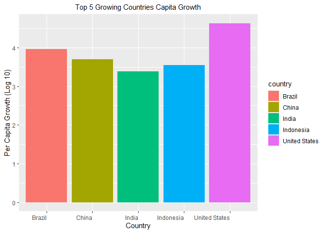

## Instructions
Answer the following questions and complete the exercises in RMarkdown. Please embed all of your code and push your final work to your repository. Your final lab report should be organized, clean, and run free from errors. Remember, you must remove the `#` for the included code chunks to run. Be sure to add your name to the author header above. For any included plots, make sure they are clearly labeled. You are free to use any plot type that you feel best communicates the results of your analysis.  

**In this homework, you should make use of the aesthetics you have learned. It's OK to be flashy!**

Make sure to use the formatting conventions of RMarkdown to make your report neat and clean!  

## Load the libraries

```r
library(tidyverse)
library(janitor)
library(here)
library(naniar)
```

## Resources
The idea for this assignment came from [Rebecca Barter's](http://www.rebeccabarter.com/blog/2017-11-17-ggplot2_tutorial/) ggplot tutorial so if you get stuck this is a good place to have a look.  

## Gapminder
For this assignment, we are going to use the dataset [gapminder](https://cran.r-project.org/web/packages/gapminder/index.html). Gapminder includes information about economics, population, and life expectancy from countries all over the world. You will need to install it before use. This is the same data that we will use for midterm 2 so this is good practice.

```r
#install.packages("gapminder")
library("gapminder")
```

## Questions
The questions below are open-ended and have many possible solutions. Your approach should, where appropriate, include numerical summaries and visuals. Be creative; assume you are building an analysis that you would ultimately present to an audience of stakeholders. Feel free to try out different `geoms` if they more clearly present your results.  

**1. Use the function(s) of your choice to get an idea of the overall structure of the data frame, including its dimensions, column names, variable classes, etc. As part of this, determine how NA's are treated in the data.**  

```r
view(gapminder)
gapminder<-clean_names(gapminder)
```

```r
glimpse(gapminder)
```

```
## Rows: 1,704
## Columns: 6
## $ country    <fct> Afghanistan, Afghanistan, Afghanistan, Afghanistan, Afgh...
## $ continent  <fct> Asia, Asia, Asia, Asia, Asia, Asia, Asia, Asia, Asia, As...
## $ year       <int> 1952, 1957, 1962, 1967, 1972, 1977, 1982, 1987, 1992, 19...
## $ life_exp   <dbl> 28.801, 30.332, 31.997, 34.020, 36.088, 38.438, 39.854, ...
## $ pop        <int> 8425333, 9240934, 10267083, 11537966, 13079460, 14880372...
## $ gdp_percap <dbl> 779.4453, 820.8530, 853.1007, 836.1971, 739.9811, 786.11...
```

```r
names(gapminder)
```

```
## [1] "country"    "continent"  "year"       "life_exp"   "pop"       
## [6] "gdp_percap"
```

```r
dim(gapminder)
```

```
## [1] 1704    6
```

```r
any_na(gapminder)
```

```
## [1] FALSE
```

**2. Among the interesting variables in gapminder is life expectancy. How has global life expectancy changed between 1952 and 2007?**

```r
gapminder$year <- as.factor(gapminder$year)
life_expectancy <- gapminder %>%
  group_by(year) %>%
  summarize(mean_life_expectancy = mean(life_exp))
```

```
## `summarise()` ungrouping output (override with `.groups` argument)
```

```r
life_expectancy
```

```
## # A tibble: 12 x 2
##    year  mean_life_expectancy
##    <fct>                <dbl>
##  1 1952                  49.1
##  2 1957                  51.5
##  3 1962                  53.6
##  4 1967                  55.7
##  5 1972                  57.6
##  6 1977                  59.6
##  7 1982                  61.5
##  8 1987                  63.2
##  9 1992                  64.2
## 10 1997                  65.0
## 11 2002                  65.7
## 12 2007                  67.0
```

```r
life_expectancy %>%
  ggplot(aes(x=year, y= mean_life_expectancy))+
  geom_point()+theme_linedraw()+
 theme(axis.text.x = element_text(angle = 15, hjust = 1), plot.title = element_text(hjust = 0)) +
  labs(title = "Global Life Expectancy Through Time",
       x = "Year",
       y= "Age")
```

<!-- -->

**3. How do the distributions of life expectancy compare for the years 1952 and 2007?**

```r
gapminder %>%
  filter (year == 1952 | year == 2007) %>%
  ggplot(aes(x= year, y= life_exp)) + 
  geom_boxplot(fill="pink")+
  theme_linedraw()+
 theme(axis.text.x = element_text(hjust = 1), plot.title = element_text(hjust = 0)) +
  labs(title = "Distribution of Life Expectancy",
       x = "Year",
       y= "Age")
```

<!-- -->

**4. Your answer above doesn't tell the whole story since life expectancy varies by region. Make a summary that shows the min, mean, and max life expectancy by continent for all years represented in the data.**


```r
gapminder %>% 
  group_by(year, continent) %>% 
  summarise(mean_life_exp=mean(life_exp),
            max_life_exp=max(life_exp),
            min_life_exp=min(life_exp))
```

```
## `summarise()` regrouping output by 'year' (override with `.groups` argument)
```

```
## # A tibble: 60 x 5
## # Groups:   year [12]
##    year  continent mean_life_exp max_life_exp min_life_exp
##    <fct> <fct>             <dbl>        <dbl>        <dbl>
##  1 1952  Africa             39.1         52.7         30  
##  2 1952  Americas           53.3         68.8         37.6
##  3 1952  Asia               46.3         65.4         28.8
##  4 1952  Europe             64.4         72.7         43.6
##  5 1952  Oceania            69.3         69.4         69.1
##  6 1957  Africa             41.3         58.1         31.6
##  7 1957  Americas           56.0         70.0         40.7
##  8 1957  Asia               49.3         67.8         30.3
##  9 1957  Europe             66.7         73.5         48.1
## 10 1957  Oceania            70.3         70.3         70.3
## # ... with 50 more rows
```

```r
gapminder %>% 
  group_by(continent) %>% 
  ggplot(aes(x=continent,y=life_exp,fill = continent))+
  geom_boxplot()+
  theme_linedraw()+
 theme(axis.text.x = element_text(hjust = 1), plot.title = element_text(hjust = 0))+
  labs(title = "Life Expectancy by Continent",
       x = "Year",
       y= "Life Expectancy")
```

<!-- -->

**5. How has life expectancy changed between 1952-2007 for each continent?**

```r
gapminder %>%
  group_by(year, continent) %>%
  summarize(life_exp = mean(life_exp)) %>%
  ggplot(aes(x= continent, y= life_exp))+
  geom_boxplot(fill="cyan")+
 theme(axis.text.x = element_text(hjust = 0), plot.title = element_text(size = rel(1), hjust = .5)) +
  labs(title = "Life Expectancy over the Years per Continent",
       x = "Continent",
       y= "Life Expectancy Average ")
```

```
## `summarise()` regrouping output by 'year' (override with `.groups` argument)
```

<!-- -->

**6. We are interested in the relationship between per capita GDP and life expectancy; i.e. does having more money help you live longer?**

```r
gapminder %>% 
  group_by(gdp_percap, life_exp) %>% 
  ggplot(aes(x= log10(gdp_percap), y= life_exp, color = continent)) +
  geom_point()+
  theme(axis.text.x = element_text(hjust = 1), plot.title = element_text(size = rel(2), hjust = .5)) +
  labs(title = "GDP vs Life Expectancy",
       x = "Log 10 of per Capita GPP",
       y= "Life Expectancy Average")
```

<!-- -->

**7. Which countries have had the largest population growth since 1952?**

```r
pop_growth<-gapminder %>% 
  group_by(country) %>% 
  filter(year=="1952"|year=="2007") %>% 
  mutate(pop_growth= pop-lag(pop, default=first(pop))) %>% 
  arrange(desc(pop_growth))
```

**8. Use your results from the question above to plot population growth for the top five countries since 1952.**

```r
pop_growth %>% 
filter(pop_growth>=133408087) %>%
  ggplot(aes(x=country, y= log10(pop_growth), fill = country))+
  geom_col()+
  theme(axis.text.x = element_text(hjust = 1), plot.title = element_text(size = rel(1), hjust = .5)) +
  labs(title = "Top 5 Fast Growing Countries",
       x = "Country",
       y= "Population Growth (Log 10)")
```

<!-- -->


**9. How does per-capita GDP growth compare between these same five countries?**

```r
pop_growth %>% 
  filter(pop_growth>=133408087) %>%
  ggplot(aes(x=country, y= log10(gdp_percap), fill= country))+
  geom_col()+
  theme(axis.text.x = element_text(hjust = 1), plot.title = element_text(size = rel(1), hjust = .5)) +
  labs(title = "Top 5 Growing Countries Capita Growth",
       x = "Country",
       y= "Per Capita Growth (Log 10)")
```

<!-- -->

**10. Make one plot of your choice that uses faceting!**

```r
gapminder %>%
  group_by(pop, country) %>%
  filter(year == "2007" & continent == "Asia") %>% 
  ggplot(aes(x=country, y=log10(pop), color=country))+
  geom_point()+
  theme(axis.text.x = element_text(angle = 90, hjust = 1), plot.title = element_text(hjust = 0)) +
  labs(title = "Population in Asia in 2007",
       x = "Country",
       y= "Log Population")
```

<!-- -->


## Push your final code to GitHub!
Please be sure that you check the `keep md` file in the knit preferences. 
