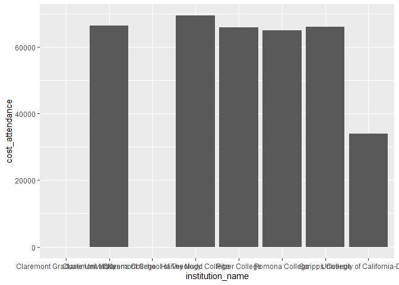
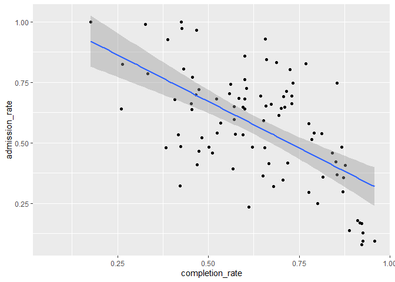
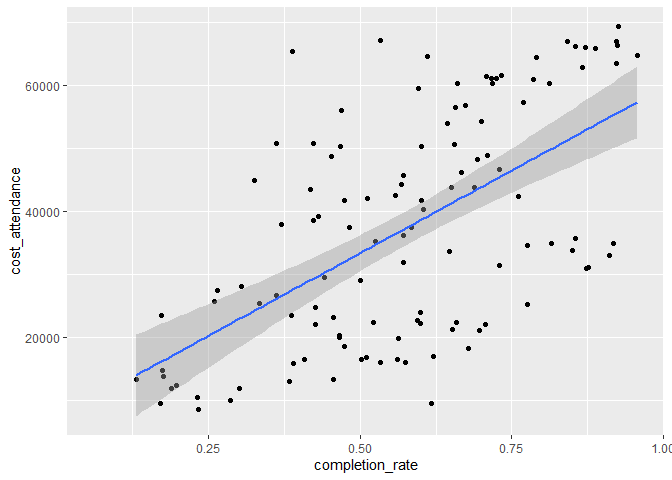
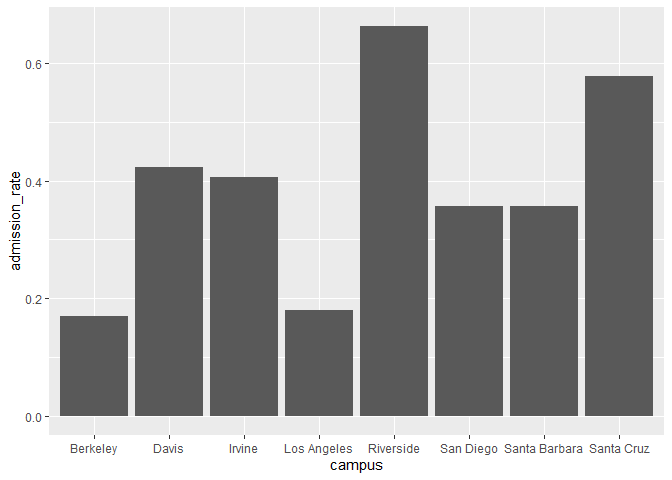
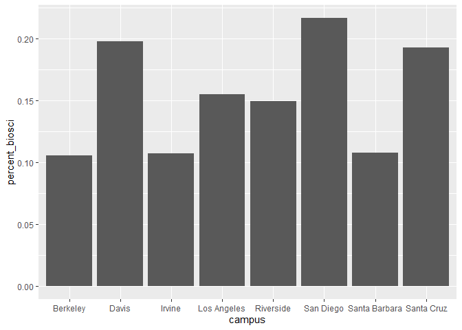

## Instructions
Answer the following questions and complete the exercises in RMarkdown. Please embed all of your code and push your final work to your repository. Your final lab report should be organized, clean, and run free from errors. Remember, you must remove the `#` for the included code chunks to run. Be sure to add your name to the author header above.  

Make sure to use the formatting conventions of RMarkdown to make your report neat and clean!  

## Load the libraries

```r
library(tidyverse)
library(janitor)
library(here)
library(naniar)
```

For this homework, we will take a departure from biological data and use data about California colleges. These data are a subset of the national college scorecard (https://collegescorecard.ed.gov/data/). Load the `ca_college_data.csv` as a new object called `colleges`.

```r
colleges <- read_csv(here("lab9/data/ca_college_data.csv"))
```

```
## 
## -- Column specification --------------------------------------------------------
## cols(
##   INSTNM = col_character(),
##   CITY = col_character(),
##   STABBR = col_character(),
##   ZIP = col_character(),
##   ADM_RATE = col_double(),
##   SAT_AVG = col_double(),
##   PCIP26 = col_double(),
##   COSTT4_A = col_double(),
##   C150_4_POOLED = col_double(),
##   PFTFTUG1_EF = col_double()
## )
```

The variables are a bit hard to decipher, here is a key:  

INSTNM: Institution name  
CITY: California city  
STABBR: Location state  
ZIP: Zip code  
ADM_RATE: Admission rate  
SAT_AVG: SAT average score  
PCIP26: Percentage of degrees awarded in Biological And Biomedical Sciences  
COSTT4_A: Annual cost of attendance  
C150_4_POOLED: 4-year completion rate  
PFTFTUG1_EF: Percentage of undergraduate students who are first-time, full-time degree/certificate-seeking undergraduate students  

1. Use your preferred function(s) to have a look at the data and get an idea of its structure. Make sure you summarize NA's and determine whether or not the data are tidy. You may also consider dealing with any naming issues.

```r
glimpse(colleges)
```

```
## Rows: 341
## Columns: 10
## $ INSTNM        <chr> "Grossmont College", "College of the Sequoias", "Coll...
## $ CITY          <chr> "El Cajon", "Visalia", "San Mateo", "Ventura", "Oxnar...
## $ STABBR        <chr> "CA", "CA", "CA", "CA", "CA", "CA", "CA", "CA", "CA",...
## $ ZIP           <chr> "92020-1799", "93277-2214", "94402-3784", "93003-3872...
## $ ADM_RATE      <dbl> NA, NA, NA, NA, NA, NA, NA, NA, NA, NA, NA, NA, NA, N...
## $ SAT_AVG       <dbl> NA, NA, NA, NA, NA, NA, NA, NA, NA, NA, NA, NA, NA, N...
## $ PCIP26        <dbl> 0.0016, 0.0066, 0.0038, 0.0035, 0.0085, 0.0151, 0.000...
## $ COSTT4_A      <dbl> 7956, 8109, 8278, 8407, 8516, 8577, 8580, 9181, 9281,...
## $ C150_4_POOLED <dbl> NA, NA, NA, NA, NA, NA, 0.2334, NA, NA, NA, NA, 0.170...
## $ PFTFTUG1_EF   <dbl> 0.3546, 0.5413, 0.3567, 0.3824, 0.2753, 0.4286, 0.230...
```

```r
names(colleges)
```

```
##  [1] "INSTNM"        "CITY"          "STABBR"        "ZIP"          
##  [5] "ADM_RATE"      "SAT_AVG"       "PCIP26"        "COSTT4_A"     
##  [9] "C150_4_POOLED" "PFTFTUG1_EF"
```


```r
colleges <- clean_names(colleges)
names(colleges)
```

```
##  [1] "instnm"        "city"          "stabbr"        "zip"          
##  [5] "adm_rate"      "sat_avg"       "pcip26"        "costt4_a"     
##  [9] "c150_4_pooled" "pftftug1_ef"
```


```r
colleges_tidy <- colleges %>% 
  rename(institution_name = "instnm", state = "stabbr" , cost_attendance = "costt4_a" , completion_rate = "c150_4_pooled", admission_rate = "adm_rate" , percent_biosci = "pcip26" , first_gen_students = "pftftug1_ef")
```
This data is tidy - variables have their own columns, observations have their own rows, each value has their own cell. 


```r
naniar::miss_var_summary(colleges_tidy)
```

```
## # A tibble: 10 x 3
##    variable           n_miss pct_miss
##    <chr>               <int>    <dbl>
##  1 sat_avg               276     80.9
##  2 admission_rate        240     70.4
##  3 completion_rate       221     64.8
##  4 cost_attendance       124     36.4
##  5 first_gen_students     53     15.5
##  6 percent_biosci         35     10.3
##  7 institution_name        0      0  
##  8 city                    0      0  
##  9 state                   0      0  
## 10 zip                     0      0
```

2. Which cities in California have the highest number of colleges?

```r
pop_city<- colleges_tidy %>% 
  count(city) %>% 
  arrange(desc(n))
```
There are the most universities in LA. 
3. Based on your answer to #2, make a plot that shows the number of colleges in the top 10 cities.

```r
pop_city %>% 
 top_n(10) %>%
    ggplot(aes(x= city, y= n))+
  geom_col()
```

```
## Selecting by n
```

<!-- -->

4. The column `COSTT4_A` is the annual cost of each institution. Which city has the highest average cost? Where is it located?

```r
costly_colleges <- colleges_tidy %>%
  select(cost_attendance, institution_name, city) %>%
  group_by(city) %>%
  summarize(mean_cost = mean(cost_attendance, na.rm= T))%>%
  arrange(desc(mean_cost))
```

```
## `summarise()` ungrouping output (override with `.groups` argument)
```

```r
costly_colleges
```

```
## # A tibble: 161 x 2
##    city                mean_cost
##    <chr>                   <dbl>
##  1 Claremont               66498
##  2 Malibu                  66152
##  3 Valencia                64686
##  4 Orange                  64501
##  5 Redlands                61542
##  6 Moraga                  61095
##  7 Atherton                56035
##  8 Thousand Oaks           54373
##  9 Rancho Palos Verdes     50758
## 10 La Verne                50603
## # ... with 151 more rows
```

5. Based on your answer to #4, make a plot that compares the cost of the individual colleges in the most expensive city. Bonus! Add UC Davis here to see how it compares :>).

```r
colleges_tidy %>%
  filter(city == "Claremont" | city == "Davis") %>%
  ggplot(aes(x = institution_name, y = cost_attendance))+
  geom_col()
```

```
## Warning: Removed 2 rows containing missing values (position_stack).
```

<!-- -->

6. The column `ADM_RATE` is the admissions rate by college and `C150_4_POOLED` is the four-year completion rate. Use a scatterplot to show the relationship between these two variables. What do you think this means?

```r
ggplot(data =  colleges_tidy, mapping = aes(x = completion_rate, y = admission_rate)) +
  geom_point() +
  geom_smooth(method=lm, se=T)
```

```
## `geom_smooth()` using formula 'y ~ x'
```

```
## Warning: Removed 251 rows containing non-finite values (stat_smooth).
```

```
## Warning: Removed 251 rows containing missing values (geom_point).
```

<!-- -->
The two are negatively correlated such that if the university has a high admission rate, they have a low completion rate and is they have a low admission rate then they have higher completion rates. 

7. Is there a relationship between cost and four-year completion rate? (You don't need to do the stats, just produce a plot). What do you think this means?

```r
ggplot(data =  colleges_tidy, mapping = aes(x = completion_rate, y = cost_attendance)) +
  geom_point() +
  geom_smooth(method=lm, se=T)
```

```
## `geom_smooth()` using formula 'y ~ x'
```

```
## Warning: Removed 225 rows containing non-finite values (stat_smooth).
```

```
## Warning: Removed 225 rows containing missing values (geom_point).
```

<!-- -->
These are positively correlated such that schools with higher completion rates then also have higher costs of attendance. 

8. The column titled `INSTNM` is the institution name. We are only interested in the University of California colleges. Make a new data frame that is restricted to UC institutions. You can remove `Hastings College of Law` and `UC San Francisco` as we are only interested in undergraduate institutions.

```r
uc_schools <- colleges_tidy %>%
  filter (str_detect(institution_name, "University of California"))
uc_schools
```

```
## # A tibble: 10 x 10
##    institution_name city  state zip   admission_rate sat_avg percent_biosci
##    <chr>            <chr> <chr> <chr>          <dbl>   <dbl>          <dbl>
##  1 University of C~ La J~ CA    92093          0.357    1324          0.216
##  2 University of C~ Irvi~ CA    92697          0.406    1206          0.107
##  3 University of C~ Rive~ CA    92521          0.663    1078          0.149
##  4 University of C~ Los ~ CA    9009~          0.180    1334          0.155
##  5 University of C~ Davis CA    9561~          0.423    1218          0.198
##  6 University of C~ Sant~ CA    9506~          0.578    1201          0.193
##  7 University of C~ Berk~ CA    94720          0.169    1422          0.105
##  8 University of C~ Sant~ CA    93106          0.358    1281          0.108
##  9 University of C~ San ~ CA    9410~         NA          NA         NA    
## 10 University of C~ San ~ CA    9414~         NA          NA         NA    
## # ... with 3 more variables: cost_attendance <dbl>, completion_rate <dbl>,
## #   first_gen_students <dbl>
```

Remove `Hastings College of Law` and `UC San Francisco` and store the final data frame as a new object `univ_calif_final`.

```r
univ_calif_final <- uc_schools %>% 
  filter(institution_name != "University of California-San Francisco") %>% 
  filter(institution_name != "University of California-Hastings College of Law")
univ_calif_final
```

```
## # A tibble: 8 x 10
##   institution_name city  state zip   admission_rate sat_avg percent_biosci
##   <chr>            <chr> <chr> <chr>          <dbl>   <dbl>          <dbl>
## 1 University of C~ La J~ CA    92093          0.357    1324          0.216
## 2 University of C~ Irvi~ CA    92697          0.406    1206          0.107
## 3 University of C~ Rive~ CA    92521          0.663    1078          0.149
## 4 University of C~ Los ~ CA    9009~          0.180    1334          0.155
## 5 University of C~ Davis CA    9561~          0.423    1218          0.198
## 6 University of C~ Sant~ CA    9506~          0.578    1201          0.193
## 7 University of C~ Berk~ CA    94720          0.169    1422          0.105
## 8 University of C~ Sant~ CA    93106          0.358    1281          0.108
## # ... with 3 more variables: cost_attendance <dbl>, completion_rate <dbl>,
## #   first_gen_students <dbl>
```

Use `separate()` to separate institution name into two new columns "UNIV" and "CAMPUS".

```r
univ_campus <- univ_calif_final %>%
  separate(institution_name, into= c("univ", "campus"), sep= "-")
univ_campus
```

```
## # A tibble: 8 x 11
##   univ  campus city  state zip   admission_rate sat_avg percent_biosci
##   <chr> <chr>  <chr> <chr> <chr>          <dbl>   <dbl>          <dbl>
## 1 Univ~ San D~ La J~ CA    92093          0.357    1324          0.216
## 2 Univ~ Irvine Irvi~ CA    92697          0.406    1206          0.107
## 3 Univ~ River~ Rive~ CA    92521          0.663    1078          0.149
## 4 Univ~ Los A~ Los ~ CA    9009~          0.180    1334          0.155
## 5 Univ~ Davis  Davis CA    9561~          0.423    1218          0.198
## 6 Univ~ Santa~ Sant~ CA    9506~          0.578    1201          0.193
## 7 Univ~ Berke~ Berk~ CA    94720          0.169    1422          0.105
## 8 Univ~ Santa~ Sant~ CA    93106          0.358    1281          0.108
## # ... with 3 more variables: cost_attendance <dbl>, completion_rate <dbl>,
## #   first_gen_students <dbl>
```

9. The column `ADM_RATE` is the admissions rate by campus. Which UC has the lowest and highest admissions rates? Produce a numerical summary and an appropriate plot.

```r
univ_campus %>%
  select(campus, admission_rate) %>%
  arrange(desc(admission_rate))
```

```
## # A tibble: 8 x 2
##   campus        admission_rate
##   <chr>                  <dbl>
## 1 Riverside              0.663
## 2 Santa Cruz             0.578
## 3 Davis                  0.423
## 4 Irvine                 0.406
## 5 Santa Barbara          0.358
## 6 San Diego              0.357
## 7 Los Angeles            0.180
## 8 Berkeley               0.169
```


```r
univ_campus %>%
    ggplot(aes(x = campus, y = admission_rate))+
  geom_col()
```

<!-- -->

10. If you wanted to get a degree in biological or biomedical sciences, which campus confers the majority of these degrees? Produce a numerical summary and an appropriate plot.

```r
univ_campus %>%
  select(campus, percent_biosci) %>%
  arrange(desc(percent_biosci))
```

```
## # A tibble: 8 x 2
##   campus        percent_biosci
##   <chr>                  <dbl>
## 1 San Diego              0.216
## 2 Davis                  0.198
## 3 Santa Cruz             0.193
## 4 Los Angeles            0.155
## 5 Riverside              0.149
## 6 Santa Barbara          0.108
## 7 Irvine                 0.107
## 8 Berkeley               0.105
```


```r
univ_campus %>%
   ggplot(aes(x = campus, y = percent_biosci))+
  geom_col() 
```

<!-- -->

## Knit Your Output and Post to [GitHub](https://github.com/FRS417-DataScienceBiologists)
